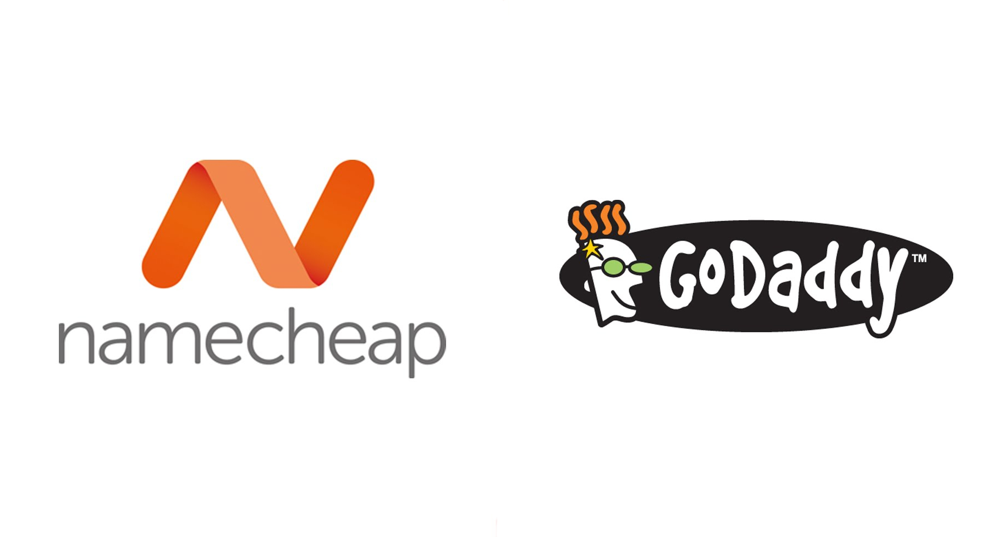

**This is my honest piece of review on the services of [Namecheap](https://www.namecheap.com/?aff=77601) and [GoDaddy](http://www.godaddy.com/). I only recommend product I personally use.**

When I created my personal homepage / blog on Tumblr (it was before I moved it to Jekyll), I badly wanted to buy the custom domain for it. I didn't want to buy the hosting, as Tumblr already provided the platform for me to blog regularly and create pages for my services and contact information. Also, Tubmlr provided almost complete control / customization (HTML/CSS, etc.), so there was no reason for me to buy the hosting for other blogging platforms (self-hosted WordPress, etc.) because I didn't want that extra functionality of those, such as plugins (i.e., PHP support), etc.

Anyway, I did google "**Cheap domains**" and found GoDaddy on top of the search page, so I thought that they were the most popular domain registrar in the world. I went through the site and completed the signup there, hoping to buy the domain. They register country specific [TLD](http://en.wikipedia.org/wiki/Top-level_domain) (Top-Level Domain) as well (**.pk** in my case), and they were showing the prices in **PKR**... which seemed good to me, because that had given me the impression that Pakistani entrepreneurs / freelancers prefer to buy domain from them. They were charging around **$14.99 / year **for **.com** domain, however, they were forcing me to buy the hosting from them as well, so for me their ordering step wasn't very user-friendly at all.

I then found another domain registrar, namely, [Namecheap](https://www.namecheap.com/?aff=77601) from the Wikipedia page of [GoDaddy](http://en.wikipedia.org/wiki/Go_Daddy) while reading the [internet freedom controversy](http://en.wikipedia.org/wiki/Stop_Online_Piracy_Act). I visited the page and fell in love with its simplicity. They were giving **.com** domain for **$10.69 / year** with a free [WHOIS](http://en.wikipedia.org/wiki/Whois) guard for the first year, so they were indeed cheaper than GoDaddy.

I don't have any experience in buying the hosting from either of them, but for getting a custom domain for your blog, I would highly recommend [Namcheap](https://www.namecheap.com/?aff=77601) because of their user-friendly website and (a bit) cheaper domain registration.

**(Some of the links above are affiliate links)**
